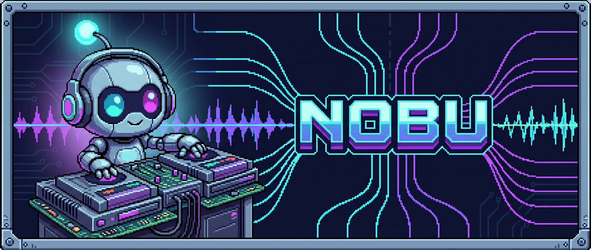

<p align="center">
  
</p>

# nobu

**Game-agnostic MCP toolkit for composing chiptune / retro MIDI and rendering game audio.**

[](LICENSE)
[](https://www.python.org/downloads/)
[](CHANGELOG.md)
[](CHANGELOG.md)

Plug nobu into **Cursor**, **Claude Desktop**, or **Kilo Code**. Ask an agent to compose a stage theme — get a real multi-track `.mid`, then render to `.ogg` / `.wav` for your engine.

nobu ships **no game-specific data**. Your project supplies tonic, mood, and biome params.

```
  agent / examples ──► nobu MCP ──► assets/midi/*.mid
                                      │
  assets/soundfonts/*.sf2 ──┐         ▼
                            └─► scripts/render_* ──► output/audio/*.ogg
```

---

## Agent-ready?

**Cursor / Claude Code / Kilo (opened on this repo):** yes — after clone the agent should read `AGENTS.md` / `CLAUDE.md`, run `python scripts/bootstrap.py`, reload MCP, and be ready. Rules/skills ship in-repo (`.cursor/rules`, `.claude/skills`); MCP/Kilo configs are **generated locally** by bootstrap (templates: `.mcp.example.json`, `.kilo/kilo.example.jsonc`).

**Cursor caveat:** new project MCP servers start **disabled** (Cursor security). After bootstrap + reload, toggle **nobu** on once under Settings → MCP (or Customize → MCP). Stays on for that workspace afterward — we cannot force-enable from the repo.

**Claude Desktop:** almost — same bootstrap, but the agent must also merge the MCP snippet into the **global** `claude_desktop_config.json` (Desktop does not auto-load project `.mcp.json`).

**Not magic:** `python` must be on PATH; open the cloned folder; reload after bootstrap; on Cursor, enable `nobu` once if it appears disabled.

## Paste this to your agent

```text
Clone https://github.com/francescojr/nobu.git (sibling folder or into this workspace).
Read AGENTS.md (and CLAUDE.md if present) and run: python scripts/bootstrap.py
If this is a game project, also run: python scripts/bootstrap.py --integrate <this_project_root>
Reload MCP. In Cursor, enable server "nobu" if it is disabled (Settings → MCP).
Confirm tools: start_project / add_layer / export_midi.
Then follow .claude/skills/game-music-producer/ and compose when I ask.
```

Integrating into an existing game:

```text
Set up https://github.com/francescojr/nobu as our game-music MCP.
Clone it next to this repo, run python scripts/bootstrap.py --integrate <absolute path to this project>,
reload MCP, and confirm tools work. Do not hardcode our game data into nobu.
```

Agents follow [AGENTS.md](AGENTS.md). Bootstrap rewrites project-local `.cursor/mcp.json` + `.mcp.json` + `.kilo/kilo.jsonc` to the local venv (never global Cursor MCP).

---

## Quick start (manual)

```bash
git clone https://github.com/francescojr/nobu.git
cd nobu
python scripts/bootstrap.py
# creates .venv, installs deps, writes .cursor/mcp.json, verifies imports
```

Then reload MCP. In **Cursor**: Settings → MCP → enable **nobu** once if disabled. Full notes: [SETUP.md](.claude/skills/game-music-producer/SETUP.md).

### Demo without MCP

```bash
python examples/demo_biome_ost.py
python scripts/render_midi.py --mode chip   # always works, no SF2 needed
# → assets/midi/*.mid  and  output/audio/*.ogg (or .wav)
```

### Render modes (chip / hybrid / full SF2)

| Mode | What you get | Requirements |
|---|---|---|
| `chip` | Pure chiptune | None (default path without SF2) |
| `hybrid` | SF2 drums + chiptune melodic | `.sf2` + `tinysoundfont` (else → chip) |
| `sf2` | Full SoundFont (all instruments) | `.sf2` + FluidSynth CLI (else → chip) |
| `auto` | Best available | Never fails — degrades to chip |

Full **SF2** always does FluidSynth → **WAV**, then converts to **OGG** (prefer `ffmpeg` on Windows). FluidSynth is not asked to write OGG directly.

```bash
python scripts/render_midi.py --mode chip
python scripts/render_midi.py --mode sf2 --soundfont assets/soundfonts/default.sf2
python scripts/render_track.py assets/midi/biome1_calm.mid --mode hybrid
```

---

## Folder layout

| Path | Purpose |
|---|---|
| `nobu_mcp.py` | MCP server entrypoint (`FastMCP("nobu")`) |
| `AGENTS.md` | Checklist agents run after clone |
| `scripts/bootstrap.py` | One-shot setup (venv, deps, Cursor `.mcp.json` + Kilo `.kilo/kilo.jsonc`) |
| `.kilo/` | Kilo Code v7+ config (`kilo.example.jsonc`, `rules/nobu.md`) |
| `assets/midi/` | Generated / authored `.mid` files |
| `assets/soundfonts/` | Your `.sf2` files (not vendored — see README there) |
| `output/audio/` | Rendered `.ogg` / `.wav` |
| `scripts/render_midi.py` | Batch MIDI → audio (`chip` / `hybrid` / `sf2` / `auto`) |
| `scripts/render_track.py` | Single-file render (same modes; SF2 → WAV → OGG) |
| `examples/demo_biome_ost.py` | Generic 4-biome × calm/combat demo |
| `.claude/skills/game-music-producer/` | Agent skill + theory references |

**Env overrides:** `NOBU_MIDI_DIR`, `NOBU_OUTPUT_DIR`, `NOBU_SF2` (also `FLUID_SYNTH_SF2`).

---

## MCP tools

| Tool | Role |
|---|---|
| `start_project` | Create an empty multi-layer project |
| `suggest_scale_for_mood` | Map scene mood → scale + pitch palette |
| `generate_scale` | Build a scale from tonic + type |
| `add_layer` | Add melody / harmony / bass / drums |
| `set_tempo_change` | Schedule BPM changes (horizontal resequencing) |
| `list_layers` | Inspect layers before export |
| `export_midi` | Write `assets/midi/{project}.mid` + loop metadata |

Mood keys: `safe_exploration`, `heroic_exploration`, `nostalgic_town`, `melancholic_dungeon`, `hostile_exotic_biome`, `magical_dreamlike`, `combat`, `victory`, `classic_retro`.

---

## SoundFonts

Place a General MIDI or chiptune `.sf2` at:

```
assets/soundfonts/default.sf2
```

Free SNES-style banks: [williamkage.com/snes_soundfonts](https://www.williamkage.com/snes_soundfonts/).  
Without a soundfont, `render_midi.py` still works via its built-in NES-style synth.

---

## Agent skill

Copy or open this repo so Cursor / Claude can load:

`.claude/skills/game-music-producer/`

When the **nobu** MCP is connected, the skill instructs the agent to call the tools and deliver real MIDI — not text-only sketches.

---

## Versioning

nobu follows [Semantic Versioning](https://semver.org/) (`MAJOR.MINOR.PATCH`).
See [CHANGELOG.md](CHANGELOG.md) ([Keep a Changelog](https://keepachangelog.com/) categories).

There is **no `[Unreleased]` section** — Cursor session hooks cut a new version
whenever a conversation ends with meaningful changes.

## Contributing

See [CONTRIBUTING.md](CONTRIBUTING.md) and [CODE_OF_CONDUCT.md](CODE_OF_CONDUCT.md).

## License

[MIT](LICENSE) — Copyright (c) 2026 nobu contributors.

---
---

# nobu (Português)

**Toolkit MCP game-agnostic para compor MIDI chiptune/retrô e renderizar áudio de jogo.**

## Cole isso no seu agente

```text
Clone https://github.com/francescojr/nobu.git.
Leia nobu/AGENTS.md e rode: python scripts/bootstrap.py
Se for um projeto de jogo, rode também: python scripts/bootstrap.py --integrate <raiz_deste_projeto>
Recarregue o MCP, confirme o server "nobu" com start_project / add_layer / export_midi.
Siga .claude/skills/game-music-producer/ e compose quando eu pedir.
```

## Início rápido (manual)

```bash
git clone https://github.com/francescojr/nobu.git
cd nobu
python scripts/bootstrap.py
python examples/demo_biome_ost.py
python scripts/render_midi.py --mode chip   # funciona sem SF2
```

Modos: `chip` (puro) · `hybrid` (SF2 drums + chip) · `sf2` (SoundFont completo).  
Sem SF2/FluidSynth → fallback automático para chiptune (não quebra).  
SF2: FluidSynth → WAV → OGG (`ffmpeg` recomendado no Windows).

Detalhes: [AGENTS.md](AGENTS.md) · [SETUP.md](.claude/skills/game-music-producer/SETUP.md).

## Pastas

| Path | Uso |
|---|---|
| `assets/midi/` | Arquivos `.mid` |
| `assets/soundfonts/` | Seus `.sf2` (não distribuídos no repo) |
| `output/audio/` | `.ogg` / `.wav` renderizados |

## Tools MCP (inglês)

`start_project` → `suggest_scale_for_mood` → `add_layer` → `list_layers` → `export_midi`

## Licença

[MIT](LICENSE).
